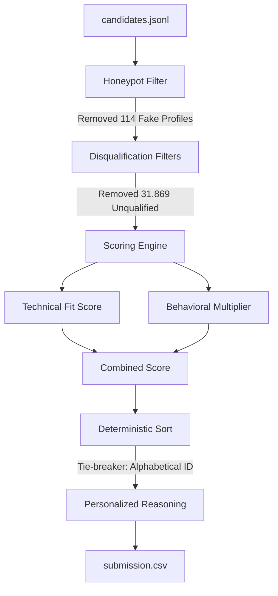

# Redrob AI Candidate Matcher & Ranker (Senior AI Engineer)

This repository contains the candidate discovery, filtering, and ranking system built for the Redrob Intelligent Candidate Discovery & Ranking Challenge. The system ranks a pool of 100,000 candidates to select the top 100 fits for the Senior AI Engineer position, filtering out honeypots (fake/impossible profiles) and unqualified applicants.

---

## 🚀 Quick Start & Reproduction

The ranking pipeline is designed using standard Python libraries, requiring **zero external dependencies** for execution. This guarantees high reliability and reproduction speeds within the sandboxed compute limits.

### 1. Reproduce the Ranking CSV
To rank the candidates and generate the final validated output CSV, run:
```bash
python rank_candidates.py --candidates ./candidates.jsonl --out ./submission.csv
```
* **Runtime**: ~12 seconds on CPU.
* **Constraints Met**: CPU-only, no network calls, <16GB RAM, completed in <1 minute.

### 2. Launch the Visual Sandbox Dashboard
To interact with the candidates, behavioral signals, and ranking metrics through a web browser, start the local server:
```bash
python app.py
```
Open **[http://localhost:8000](http://localhost:8000)** in your browser to view the premium dashboard. You can:
* Click **"Rank Local candidates.jsonl"** to run the ranking logic directly.
* Load a smaller sample (50 candidates) using **"Load Sample Candidates"**.
* Click any candidate card to slide in a detailed signal view showing their full career history, education, matching scores, and 23 behavioral signals.
* Filter candidates by required skills, experience range, and notice period.

---

## 🛠️ Pipeline Architecture

The ranking pipeline consists of a multi-stage logic implemented in `rank_candidates.py`:



### 1. Honeypot & Fake Profile Filter
Detects and removes **114 fake profiles** using three strict rules:
* **Expert Skills with 0 Duration**: Any profile listing a skill as `expert` but having `duration_months: 0`.
* **Job Tenure Exceeding Total Experience**: Any job durational sum that exceeds the profile's stated total years of experience (`duration_months / 12 > years_of_experience + 0.5`).
* **Startup Founding Date Anachronisms**: *Krutrim* and *Sarvam AI* were founded in late 2023. Any candidate claiming to have worked there starting before 2023 is flagged as a honeypot.

### 2. Disqualification Filters
Cleans out **31,869 candidates** that do not fit the job profile:
* **Pure Academic/Research**: Removes candidates who have only academic roles (PhD student, Postdoc, Research Assistant) and lack production experience.
* **Consulting-Only**: Removes candidates whose entire career history consists exclusively of IT consulting/services firms (TCS, Infosys, Wipro, Accenture, Cognizant, Capgemini, etc.).
* **CV/Speech/Robotics Only**: Filters out computer vision or speech specialists who have zero NLP, Information Retrieval, Search, or RAG-related experience.

### 3. Scoring & Ranking
* **Technical Fit Score**: Scores candidates on years of experience (ideal range: 5-9 years, with 6-8 years receiving a boost), core database/retrieval/eval skills, product company tenure, and elite college tier.
* **Behavioral Multiplier**: Uses platform engagement signals (`open_to_work`, recruiter response rate, low response latency, active recency, GitHub score, short notice period, and Pune/Noida location fit) to dynamically boost or penalize candidates.
* **Tie-Breaker**: Scores are sorted descending. Any exact score ties are deterministically resolved alphabetically by `candidate_id` ascending to ensure validator alignment.

---

## 📂 Repository File Structure

* `rank_candidates.py`: Main script containing the candidate ranking, filtering, and scoring logic.
* `app.py`: Simple server providing the ranking endpoint API and serving static files.
* `index.html`: Premium glassmorphic dashboard interface for visual interaction.
* `submission_metadata.yaml`: Team identification, compute environment details, and declarations.
* `verify_submission.py`: High-fidelity verifier to audit the final CSV file for compliance and honeypot leaks.
* `validate_submission.py`: Hackathon bundle validator to double-check formatting before upload.
* `requirements.txt`: Python package requirements (none required, standard library only).
